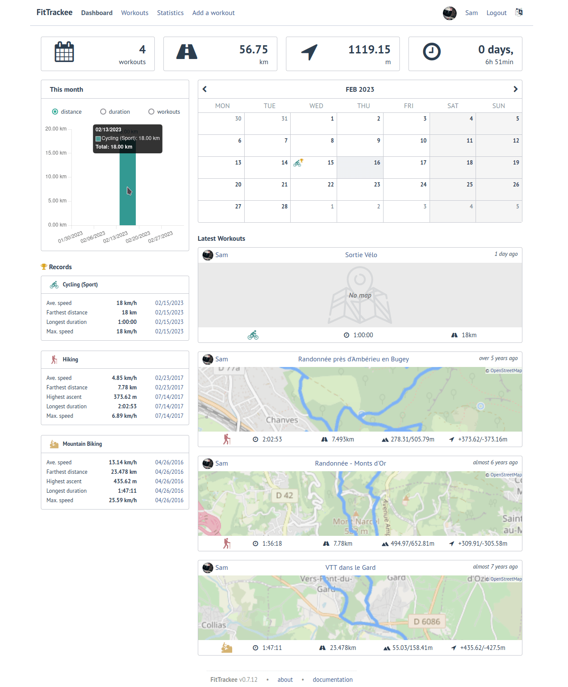

<!--
NOTA: Este README foi creado automáticamente por <https://github.com/YunoHost/apps/tree/master/tools/readme_generator>
NON debe editarse manualmente.
-->

# FitTrackee para YunoHost

[](https://ci-apps.yunohost.org/ci/apps/fittrackee/)  

[](https://install-app.yunohost.org/?app=fittrackee)

*[Le este README en outros idiomas.](./ALL_README.md)*

> *Este paquete permíteche instalar FitTrackee de xeito rápido e doado nun servidor YunoHost.*  
> *Se non usas YunoHost, le a [documentación](https://yunohost.org/install) para saber como instalalo.*

## Vista xeral

FitTrackee allows you to track your outdoor activities (workouts) from gpx files and keep your data on your own server.
No mobile app has been developed yet, but several existing mobile apps can store workouts data locally and export them into a gpx file.


**Versión proporcionada:** 0.8.6~ynh1

## Capturas de pantalla



## Documentación e recursos

- Web oficial da app: <https://samr1.github.io/FitTrackee>
- Documentación oficial para admin: <https://samr1.github.io/FitTrackee>
- Repositorio de orixe do código: <https://github.com/SamR1/FitTrackee>
- Tenda YunoHost: <https://apps.yunohost.org/app/fittrackee>
- Informar dun problema: <https://github.com/YunoHost-Apps/fittrackee_ynh/issues>

## Info de desenvolvemento

Envía a túa colaboración á [rama `testing`](https://github.com/YunoHost-Apps/fittrackee_ynh/tree/testing).

Para probar a rama `testing`, procede deste xeito:

```bash
sudo yunohost app install https://github.com/YunoHost-Apps/fittrackee_ynh/tree/testing --debug
ou
sudo yunohost app upgrade fittrackee -u https://github.com/YunoHost-Apps/fittrackee_ynh/tree/testing --debug
```

**Máis info sobre o empaquetado da app:** <https://yunohost.org/packaging_apps>
