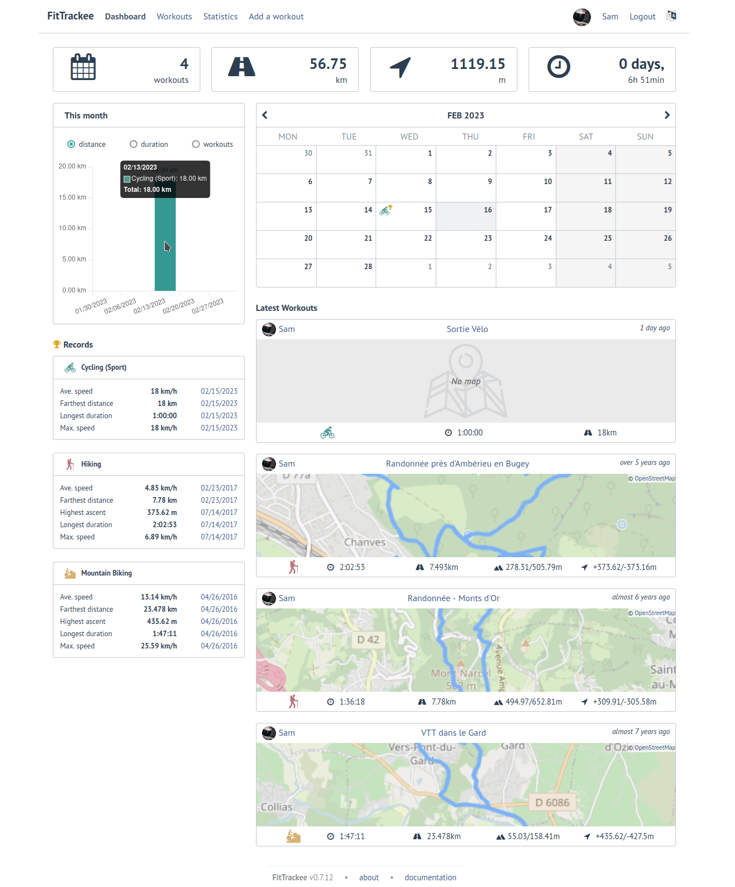

<!--
注意：此 README 由 <https://github.com/YunoHost/apps/tree/master/tools/readme_generator> 自动生成
请勿手动编辑。
-->

# YunoHost 的 FitTrackee

[](https://dash.yunohost.org/appci/app/fittrackee)  

[](https://install-app.yunohost.org/?app=fittrackee)

*[阅读此 README 的其它语言版本。](./ALL_README.md)*

> *通过此软件包，您可以在 YunoHost 服务器上快速、简单地安装 FitTrackee。*  
> *如果您还没有 YunoHost，请参阅[指南](https://yunohost.org/install)了解如何安装它。*

## 概况

FitTrackee allows you to track your outdoor activities (workouts) from gpx files and keep your data on your own server.
No mobile app has been developed yet, but several existing mobile apps can store workouts data locally and export them into a gpx file.


**分发版本：** 0.7.32~ynh1

## 截图



## 文档与资源

- 官方应用网站： <https://samr1.github.io/FitTrackee>
- 官方管理文档： <https://samr1.github.io/FitTrackee>
- 上游应用代码库： <https://github.com/SamR1/FitTrackee>
- YunoHost 商店： <https://apps.yunohost.org/app/fittrackee>
- 报告 bug： <https://github.com/YunoHost-Apps/fittrackee_ynh/issues>

## 开发者信息

请向 [`testing` 分支](https://github.com/YunoHost-Apps/fittrackee_ynh/tree/testing) 发送拉取请求。

如要尝试 `testing` 分支，请这样操作：

```bash
sudo yunohost app install https://github.com/YunoHost-Apps/fittrackee_ynh/tree/testing --debug
或
sudo yunohost app upgrade fittrackee -u https://github.com/YunoHost-Apps/fittrackee_ynh/tree/testing --debug
```

**有关应用打包的更多信息：** <https://yunohost.org/packaging_apps>
